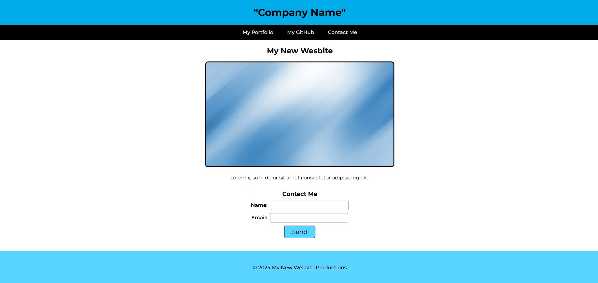

# Simple HTML & CSS Landing Page

## Project Overview

A landing page using HTML and CSS. Implements a contact form as well as a polished UI.

## Table of Contents

- [Usage](#usage)
- [Mock Up](#mock-up)
- [Instructions](#instructions)
- [Key Features](#key-features)
- [Technology Stack](#technology-stack)
- [Additional Resources](#additional-resources)

## Usage

Open the `index.html` file to view the landing page and test its functionality.

## Mock-Up

The following image shows the web application's appearance and functionality:

## Instructions

The application should meet the following criteria:

- Use a descriptive alt attribute for the image.
- Deploy the page to GitHub Pages for accessibility.
- Implement a contact link that scrolls to the contact form.
- Use semantic HTML elements to create a clean, accessible structure.
- Implement a landing page that includes a header, footer, and a contact form.
- Ensure the header is fixed at the top and contains a navigation bar with three links.
- Style the page with CSS, ensuring it uses at least three colors and a single font family.

## Key Features

- Fixed header with navigation links.
- Descriptive image with an alt attribute.
- Responsive design using CSS for styling and layout.
- Contact form with input elements for name and email.

## Technology Stack

This project uses the following tools and technologies:

- **HTML:** Structure of the landing page with semantic elements.
- **GitHub Pages:** For deploying the landing page for public access.
- **CSS:** Styling the page with universal and class selectors, colors, and font.

## Additional Resources

Learn more about CSS Color: [MDN Web Docs on Color](https://developer.mozilla.org/en-US/docs/Web/CSS/color)

Learn more about Font Styling: [MDN Web Docs on Font](https://developer.mozilla.org/en-US/docs/Web/CSS/font)

Learn more about the Button Element: [MDN Web Docs on Button](https://developer.mozilla.org/en-US/docs/Web/HTML/Element/button)

Learn more about structuring a Web Form: [MDN Web Docs on Forms](https://developer.mozilla.org/en-US/docs/Learn/Forms/How_to_structure_a_web_form)

Learn more about HTML Elements: [MDN Web Docs on HTML Elements](https://developer.mozilla.org/en-US/docs/Web/HTML/Element)
